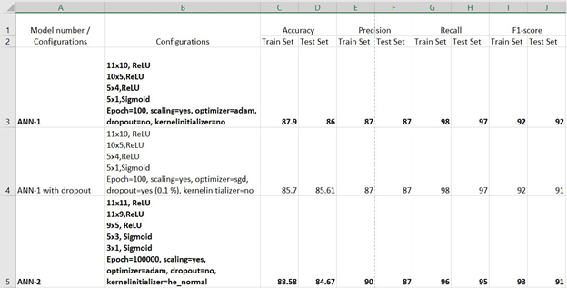
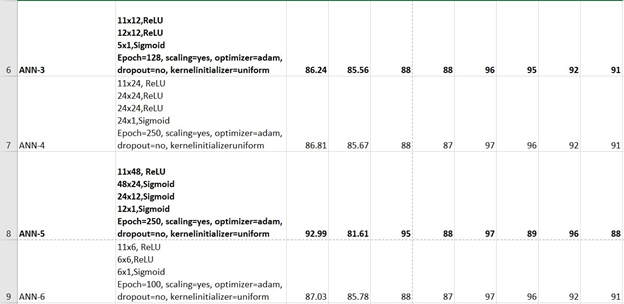

# CustomerChurnModel

 Neural Network Classifier

Customer churn occurs when customers stop doing business with a company, also known as customer attrition. It is also referred to as loss of clients or customers. You are given sensitive information of 9,000 of an European Bank, EBQ. Your task is to build an Artificial Neural Network (ANN) based on the dataset such that later the ANN model can predict correctly which of the 1,000 customers (in a separate unlabeled judge set) the bank is going to lose. This predictive analysis is vital for the EBQ bank to revise their business strategy towards customer retention. What do you think? Anyway, you are recruited by the bank to do the analysis. And, the head of the bank only trusts heads, i.e., brains.... I mean neural networks for making any decisions.

Report of ANN Configurations and corresponding Accuracy,
Precision, Recall, F1-score on

Train and
Test data

Report of
ANN Configurations and corresponding Accuracy, Precision, Recall, F1-score on

Train and
Test data

From the above report table, we can conclude that model ANN-1
shows better performance with accuracy 86% and hence I am using the same to
predict judge.csv dataset.
